# 🌐 Portfolio React – Devoir 5 CEF


Projet réalisé dans le cadre du **Devoir 5 – Développeur Web & Web Mobile (CEF)**.  
Ce projet consiste à créer un **portfolio professionnel** avec **React**, **Bootstrap** et **Vite**.

---

## SOMMAIRE

- [Objectifs du projet](#-objectifs-du-projet)
- [Fonctionnalités principales](#-fonctionnalités-principales)
- [Technologies utilisées](#-technologies-utilisées)
- [Accessibilité (A11y)](#-accessibilité-a11y)
- [SEO & Performance](#-seo--performance)
- [Aperçu du projet](#-aperçu-du-projet)
- [Installation et lancement du projet en développement](#-installation-et-lancement-du-projet-en-développement)
- [Installation de la version buildée et prévisualisation](#-installation-de-la-version-buildée-et-prévisualisation)
- [Auteur](#-auteur)
- [Validation finale](#-validation-finale)
- [Historique des mises à jour](#-historique-des-mises-à-jour)
- [Livraison du projet](#-livraison-du-projet)

---

## 🎯 Objectifs du projet

- Créer une application React fonctionnelle et responsive (mobile / tablette / desktop),
- Utiliser **React Router** pour la navigation entre les pages :
  - Accueil (Home)
  - Services
  - Portfolio
  - Contact
  - Mentions légales
- Intégrer une **modale** affichant les informations GitHub via l’API publique,
- Intégrer un formulaire de contact et une Iframe Google Map,
- Respecter les standards **W3C** et les bonnes pratiques **SEO** et **A11y**,
- Fournir un dépôt GitHub propre et documenté.

---

## 🚀 Fonctionnalités principales

- 5 pages responsive (mobile / tablette / Desktop) : Accueil, Services, Portfolio, Contact, Mentions Légales
- Navbar et Footer + scroll-to-top sur les liens des pages internes du footer
- Modale GitHub alimentée par l'API publique
- Formulaire de contact
- Composants modulaires et réutilisables
- Animation CSS (hover, cartes, modale, icônes)
- Données centralisées (projets, mentions légales, services, modale GitHub)

---

## 🛠️ Technologies utilisées

| Technologie | Utilisation |
|-------------|-------------|
| ⚛️ React.js | Framework principal |
| 🧭 React Router DOM | Gestion de la navigation |
| ⚡ Vite | Environnement de développement |
| 🎨 Bootstrap 5 | Mise en forme et responsive design |
| 🧹 ES Lint | Qualité du code |
| ✨ Prettier | Indentation |
| ☁️ API GitHub | Récupération des données du profil |
| Bootstrap Icons | Icônes |
| Git & GitHub | Versioning et collaboration |

---

## ♿ Accessibilité (A11y)

- Balises sémantiques adaptées et cohérentes
- Titres hierarchisés
- ARIA :
  - `aria-label` sur les icônes/boutons non textuels,
  - `aria-labelledby` pour lier les sections et la modale à leurs titres,
  - `aria-describedby` et `aria-invalid` sur les champs de formulaire et les messages d'erreur,
  - Icônes décoratives masquées via `aria-hidden`
- Inputs accompagnés de leurs labels accessibles
- Progress Bar complète (value, min, max, role)
- Modale accessible (focus, role dialog, aria-modal) avec titre et description
- Contraste OK

---

## 🔎 SEO & Performance

- balise `<title>` optimisée
- SEO basique :
  - Titres optimisées,
  - Meta description
  - Structure Hn,
  - attributs alt,
  - meta robots
- Images avec alt descriptifs
- Optimisation du DOM avec des composants réutilisables
- Chargement rapide via Vite

---

## 📸 Aperçu du projet

<div style="
display: grid;
grid-template-columns: repeat(3, 1fr);
align-items: start;
gap: 16px;
width: 100%;
margin-bottom: 16px;
box-sizing: border-box;
border: 1px solid #d1d9e0;
border-radius: 8px;
padding: 16px;
">
  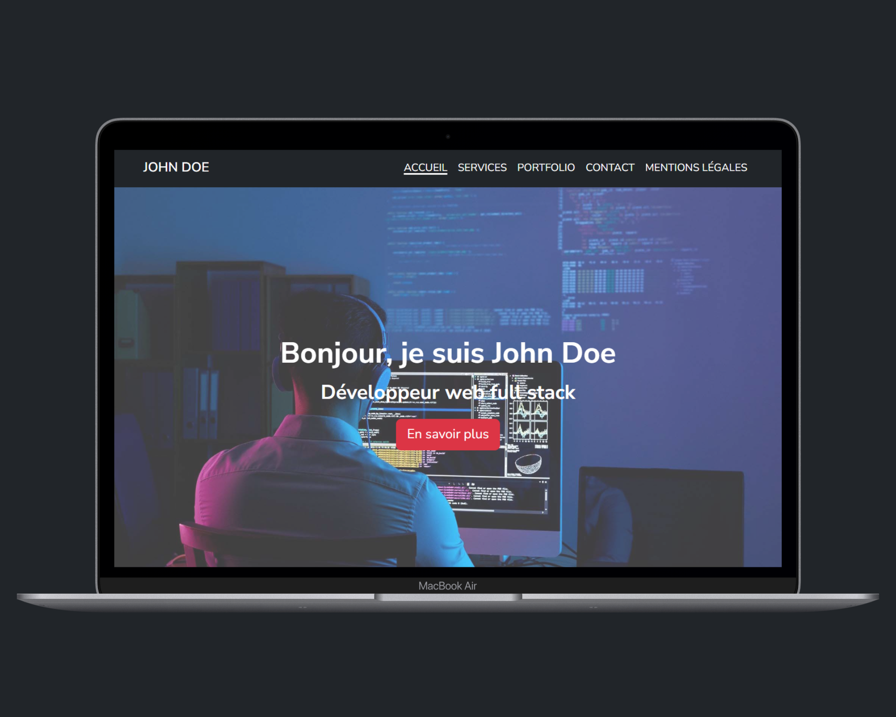
  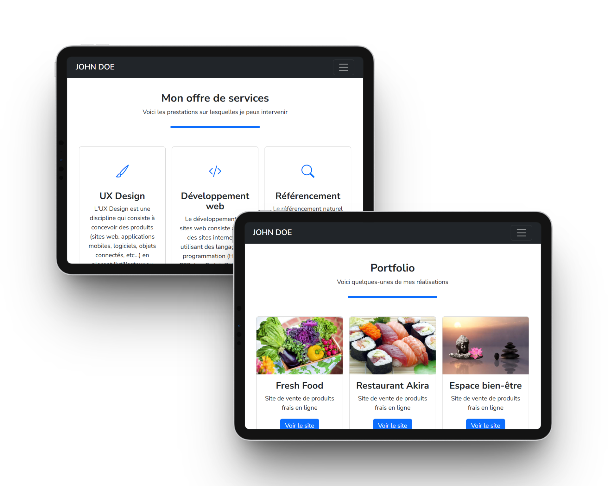
  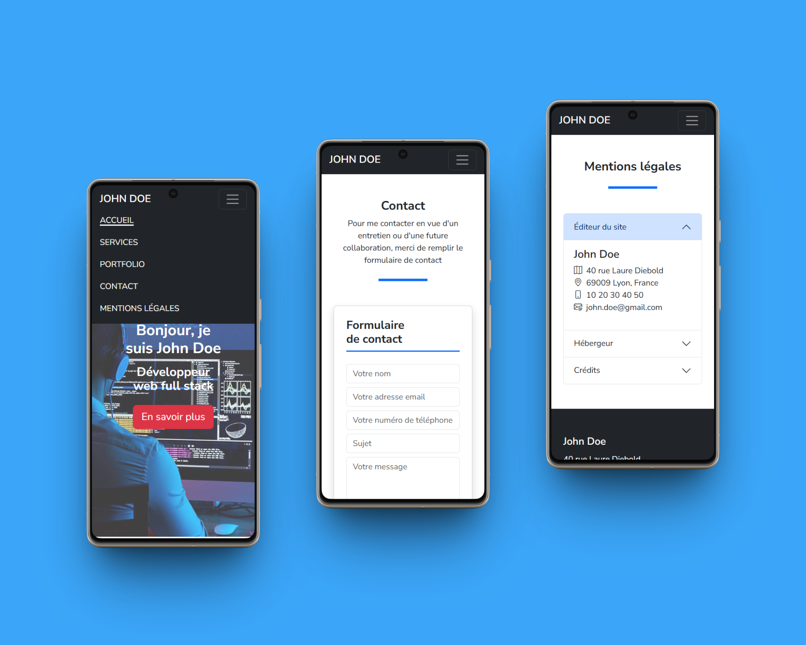
</div>

Voici un aperçu visuel du site sur les trois formats (Desktop, Tablette, Mobile) pour chaque page du projet :

<div style="
padding: 16px;
border: 1px solid #d1d9e0;
border-radius: 8px">

  <!-- PAGE D'ACCUEIL -->
  <details>
  <summary style="
  font-size: 1.1rem;
  font-weight: 500;
  padding-bottom: 4px;
  margin-bottom: 8px;
  border-bottom: 1px solid #d1d9e0">
    Accueil
  </summary>

  <div style="
  display: flex;
  gap: 16px;
  align-items: flex-start;
  ">
    <div>
      <div style="
      color: #000;
      background-color: #f6f8fa;
      font-weight: 600;
      border-radius: 10px 10px 0 0;
      padding: 4px 8px;
      text-align: center">
          Desktop
      </div>
      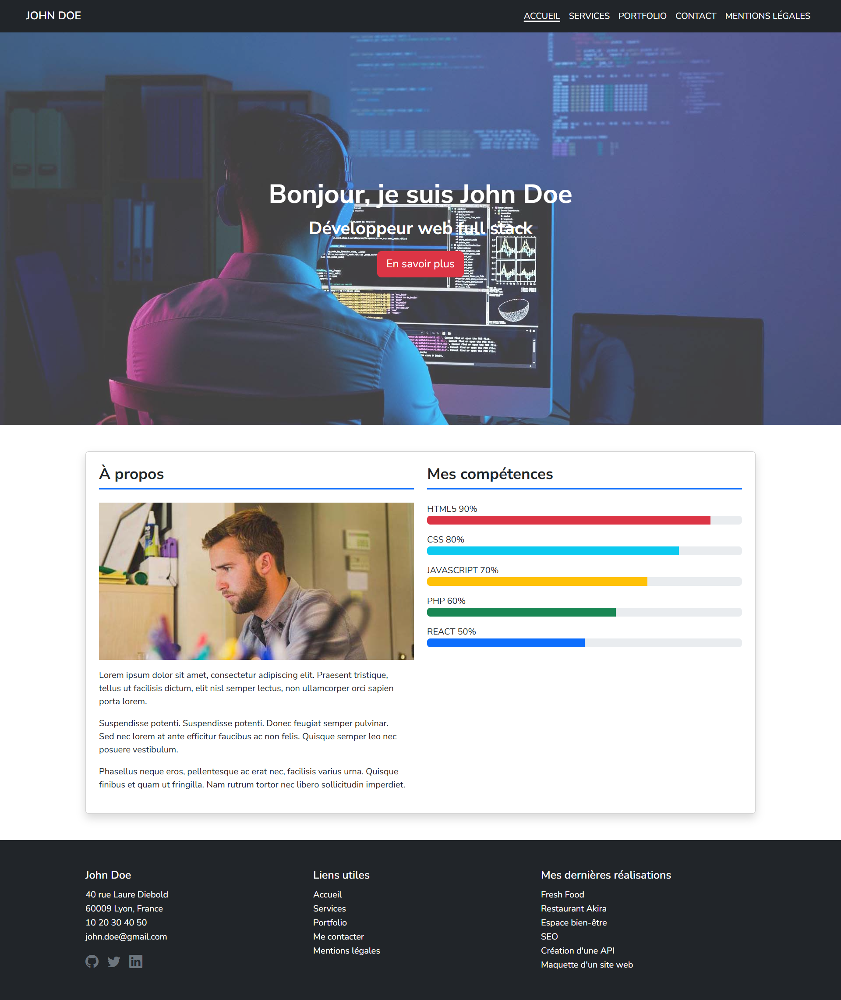
    </div>
    <div>
      <div style="
      color: #000;
      background-color: #f6f8fa;
      font-weight: 600;
      border-radius: 10px 10px 0 0;
      padding: 4px 8px;
      text-align: center">
          Tablette
      </div>
      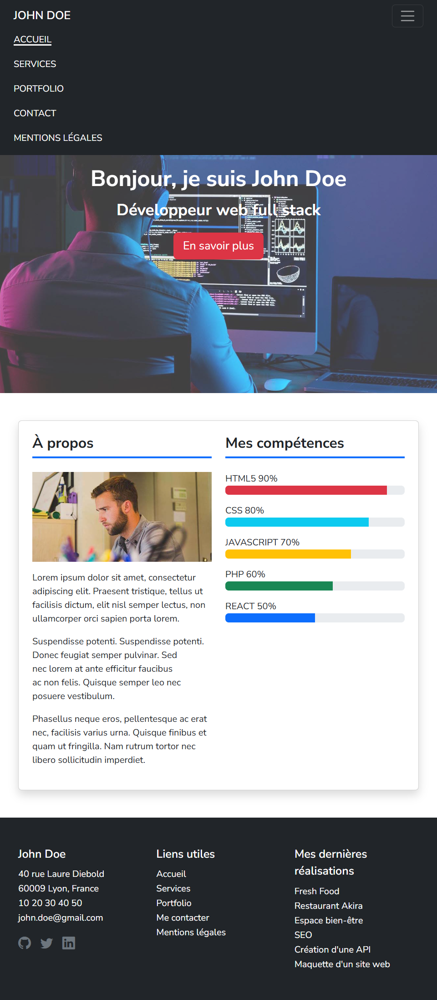
    </div>
    <div>
      <div style="
      color: #000;
      background-color: #f6f8fa;
      font-weight: 600;
      border-radius: 10px 10px 0 0;
      padding: 4px 8px;
      text-align: center">
          Mobile
      </div>
      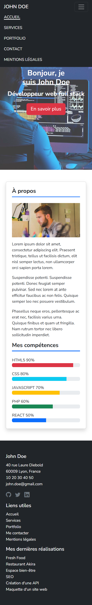
    </div>
  </div>
  </details>

  <!-- PAGE SERVICES -->
  <details>
  <summary style="
  font-size: 1.1rem;
  font-weight: 500;
  padding-bottom: 4px;
  margin-bottom: 8px;
  border-bottom: 1px solid #d1d9e0">
    Services
  </summary>

  <div style="
  display: flex;
  gap: 16px;
  align-items: flex-start;
  ">
    <div>
      <div style="
      color: #000;
      background-color: #f6f8fa;
      font-weight: 600;
      border-radius: 10px 10px 0 0;
      padding: 4px 8px;
      text-align: center">
          Desktop
      </div>
      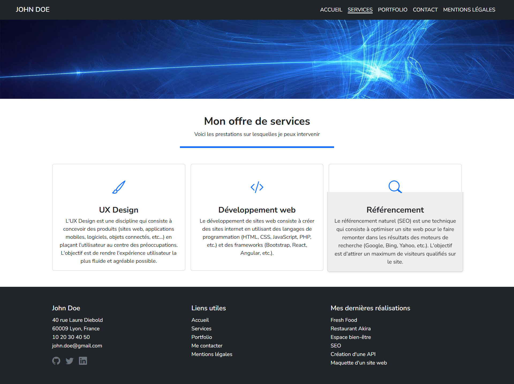
    </div>
    <div>
      <div style="
      color: #000;
      background-color: #f6f8fa;
      font-weight: 600;
      border-radius: 10px 10px 0 0;
      padding: 4px 8px;
      text-align: center">
          Tablette
      </div>
      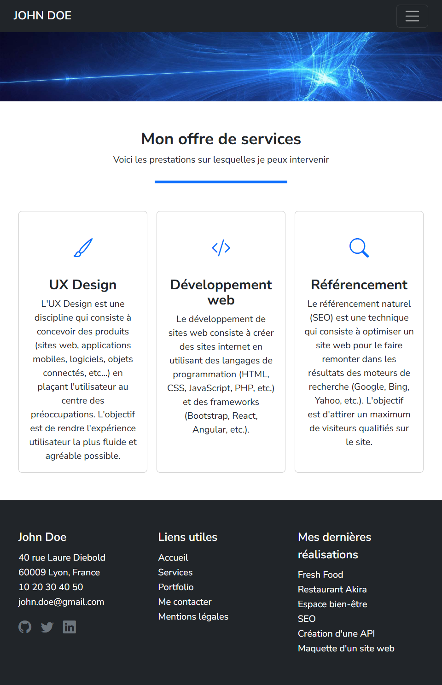
    </div>
    <div>
      <div style="
      color: #000;
      background-color: #f6f8fa;
      font-weight: 600;
      border-radius: 10px 10px 0 0;
      padding: 4px 8px;
      text-align: center">
          Mobile
      </div>
      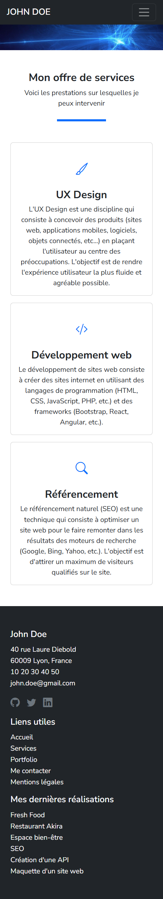
    </div>
  </div>
  </details>

  <!-- PAGE PORTFOLIO -->
  <details>
  <summary style="
  font-size: 1.1rem;
  font-weight: 500;
  padding-bottom: 4px;
  margin-bottom: 8px;
  border-bottom: 1px solid #d1d9e0">
    Portfolio
  </summary>

  <div style="
  display: flex;
  gap: 16px;
  align-items: flex-start;
  ">
    <div>
      <div style="
      color: #000;
      background-color: #f6f8fa;
      font-weight: 600;
      border-radius: 10px 10px 0 0;
      padding: 4px 8px;
      text-align: center">
          Desktop
      </div>
      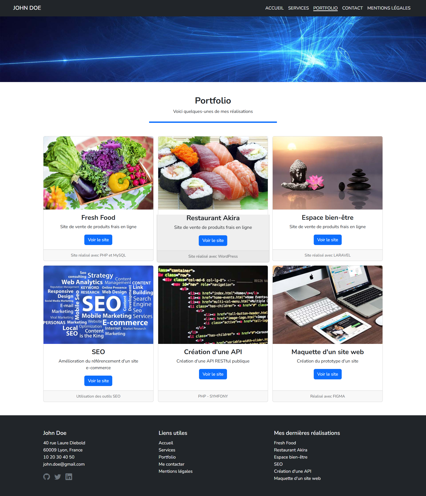
    </div>
    <div>
      <div style="
      color: #000;
      background-color: #f6f8fa;
      font-weight: 600;
      border-radius: 10px 10px 0 0;
      padding: 4px 8px;
      text-align: center">
          Tablette
      </div>
      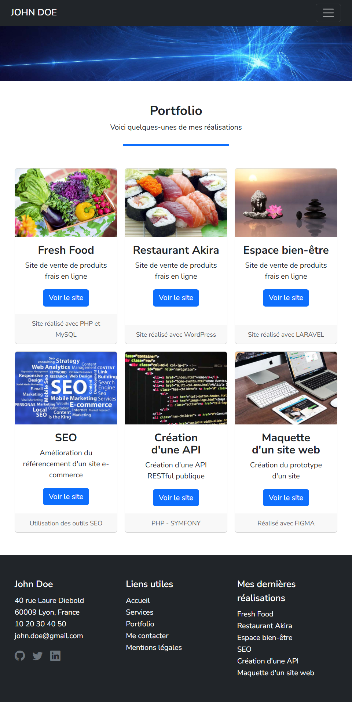
    </div>
    <div>
      <div style="
      color: #000;
      background-color: #f6f8fa;
      font-weight: 600;
      border-radius: 10px 10px 0 0;
      padding: 4px 8px;
      text-align: center">
          Mobile
      </div>
      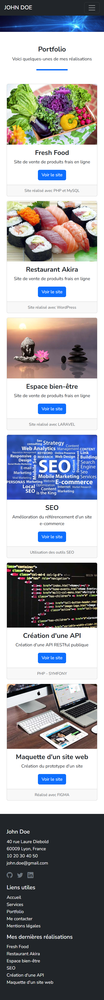
    </div>
  </div>
  </details>

  <!-- PAGE CONTACT -->
  <details>
  <summary style="
  font-size: 1.1rem;
  font-weight: 500;
  padding-bottom: 4px;
  margin-bottom: 8px;
  border-bottom: 1px solid #d1d9e0">
    Contact
  </summary>

  <div style="
  display: flex;
  gap: 16px;
  align-items: flex-start;
  ">
    <div>
      <div style="
      color: #000;
      background-color: #f6f8fa;
      font-weight: 600;
      border-radius: 10px 10px 0 0;
      padding: 4px 8px;
      text-align: center">
          Desktop
      </div>
      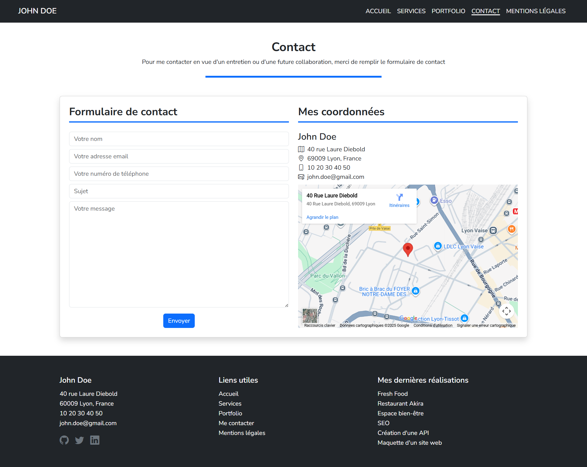
    </div>
    <div>
      <div style="
      color: #000;
      background-color: #f6f8fa;
      font-weight: 600;
      border-radius: 10px 10px 0 0;
      padding: 4px 8px;
      text-align: center">
          Tablette
      </div>
      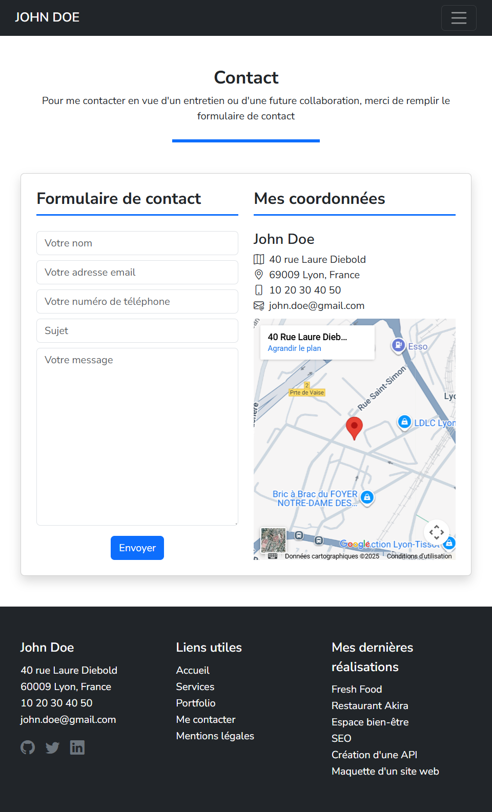
    </div>
    <div>
      <div style="
      color: #000;
      background-color: #f6f8fa;
      font-weight: 600;
      border-radius: 10px 10px 0 0;
      padding: 4px 8px;
      text-align: center">
          Mobile
      </div>
      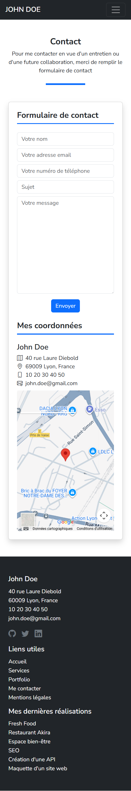
    </div>
  </div>
  </details>

  <!-- PAGE MENTIONS-LÉGALES -->
  <details>
  <summary style="
  font-size: 1.1rem;
  font-weight: 500;
  padding-bottom: 4px;
  margin-bottom: 8px;
  border-bottom: 1px solid #d1d9e0">
    Mentions légales
  </summary>

  <div style="
  display: flex;
  gap: 16px;
  align-items: flex-start;
  ">
    <div>
      <div style="
      color: #000;
      background-color: #f6f8fa;
      font-weight: 600;
      border-radius: 10px 10px 0 0;
      padding: 4px 8px;
      text-align: center">
          Desktop
      </div>
      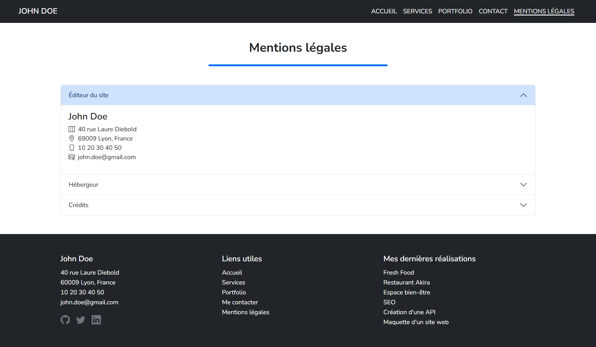
    </div>
    <div>
      <div style="
      color: #000;
      background-color: #f6f8fa;
      font-weight: 600;
      border-radius: 10px 10px 0 0;
      padding: 4px 8px;
      text-align: center">
          Tablette
      </div>
      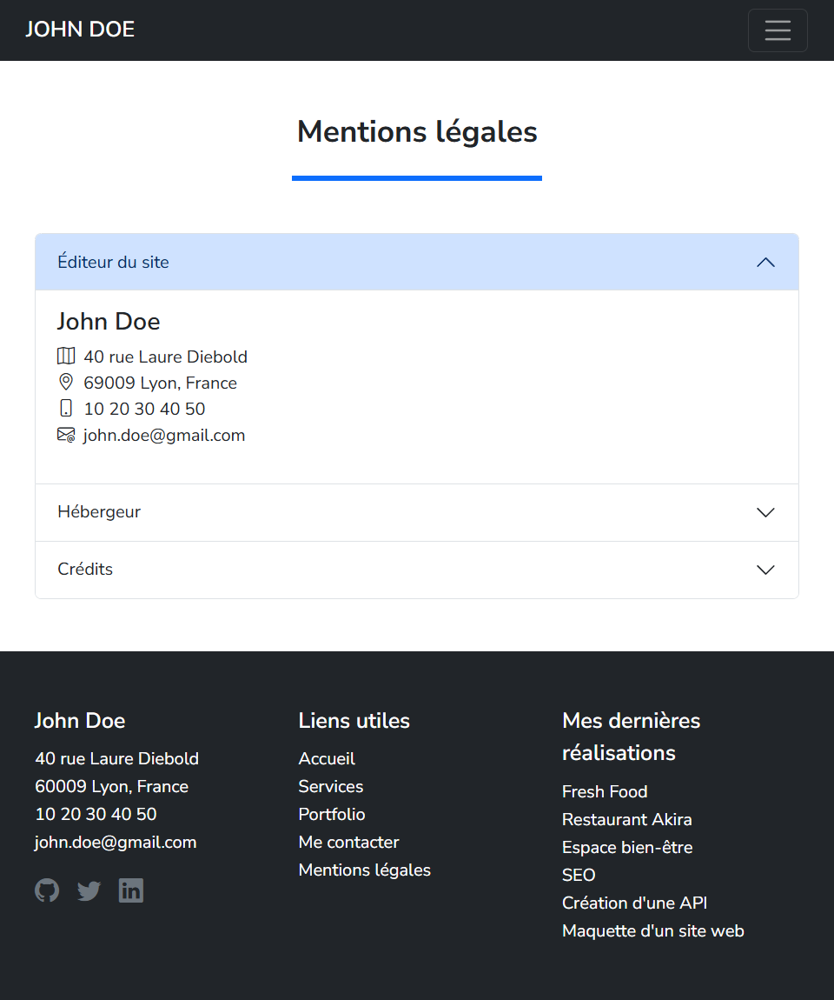
    </div>
    <div>
      <div style="
      color: #000;
      background-color: #f6f8fa;
      font-weight: 600;
      border-radius: 10px 10px 0 0;
      padding: 4px 8px;
      text-align: center">
          Mobile
      </div>
      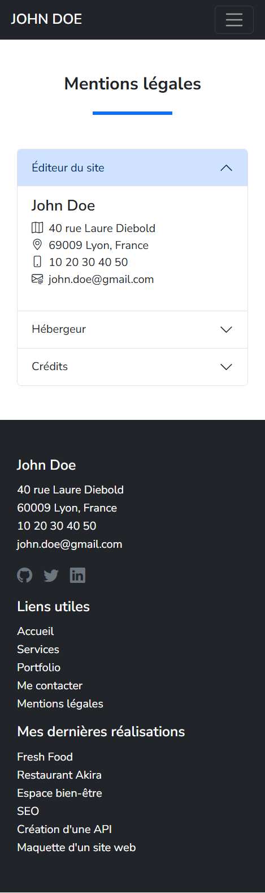
    </div>
  </div>
  </details>
</div>

---

## 📦 Installation et lancement du projet en développement

```bash
# Cloner le dépôt
git clone https://github.com/cedrickernec/kernec-cedric-devoir-5-portfolio-react.git

# Accéder au dossier
cd kernec-cedric-devoir-5-portfolio-react

# Installer les dépendances
npm install

# Lancer le serveur de développement
npm run dev
```

## 🏗️ Installation de la version buildée et prévisualisation

```bash
# Build de production
npm run build

# Prévisualisation de la version buildée
npx vite preview
```

---

## 🧑‍💻 Auteur

[](https://github.com/cedrickernec)

---

## ✅ Validation finale

Le projet fait l’objet :
- de commits explicites (Closes #1, etc.),
- de captures de validation W3C,
- de captures d'aperçu du site (mobile / tablette / desktop),
- d'une optimsation SEO et A11y,
- et d’un README complet.

### 🕵 Audit

<table style="width: 100%; border-collapse: collapse">
  <tr>
    <!-- COLONNE 1 : LIGHTHOUSE DESKTOP -->
    <td style="width:50%; vertical-align:top; padding:0 8px 0 0;">
      <div style="
        border:1px solid #d1d9e0;
        border-radius:8px;
        overflow:hidden;
      ">
        <div style="
          background:#f6f8fa;
          color: #000;
          padding:8px 12px;
          font-weight:600;
        ">
          Score Lighthouse – Desktop
        </div>
        <!-- SCORING -->
        <div style="
          padding:16px;
          display:flex;
          flex-wrap:wrap;
          justify-content:center;
          gap:24px;
        ">
          <div style="text-align:center;">
            <div style="
              width:65px; height:65px; border-radius:50%;
              border:4px solid #00c853; background:#071e11;
              display:flex; align-items:center; justify-content:center;
              font-size:1.6rem; font-weight:bold; color:#00c853;">
              100
            </div>
            <div style="margin-top:8px; font-weight:600;">Performance</div>
          </div>
          <div style="text-align:center;">
            <div style="
              width:65px;
              height:65px;
              border-radius:50%;
              border:4px solid #00c853;
              background:#071e11;
              display:flex;
              align-items:center;
              justify-content:center;
              font-size:1.6rem;
              font-weight:bold;
              color:#00c853;">
              100
            </div>
            <div style="margin-top:8px; font-weight:600;">Accessibility</div>
          </div>
          <div style="text-align:center;">
            <div style="
              width:65px;
              height:65px;
              border-radius:50%;
              border:4px solid #00c853;
              background:#071e11;
              display:flex;
              align-items:center;
              justify-content:center;
              font-size:1.6rem;
              font-weight:bold;
              color:#00c853;">
              100
            </div>
            <div style="margin-top:8px; font-weight:600;">Best Practices</div>
          </div>
          <div style="text-align:center;">
            <div style="
              width:65px;
              height:65px;
              border-radius:50%;
              border:4px solid #00c853;
              background:#071e11;
              display:flex;
              align-items:center;
              justify-content:center;
              font-size:1.6rem;
              font-weight:bold;
              color:#00c853;">
              100
            </div>
            <div style="margin-top:8px; font-weight:600;">SEO</div>
          </div>
        </div>
        <!-- DOWNLOAD PDF -->
        <a
        href="./public/readme/audit-validation/lighthouse-audit/lighthouse-desktop.pdf"
        style="display: block; margin-bottom: 10px; text-decoration: underline; text-align: center
        ">
        ➜] Version PDF
        </a>
      </div>
    </td>
    <!-- COLONNE 2 : LIGHTHOUSE MOBILE -->
    <td style="width:50%; vertical-align:top; padding:0 0 0 8px">
      <div style="
        border:1px solid #d1d9e0;
        border-radius:8px;
        overflow:hidden;
      ">
        <div style="
          background:#f6f8fa;
          color: #000;
          padding:8px 12px;
          font-weight:600;
        ">
          Score Lighthouse – Mobile
        </div>
        <!-- SCORING -->
        <div style="
          padding:16px;
          display:flex;
          flex-wrap:wrap;
          justify-content:center;
          gap:24px;
        ">
          <div style="text-align:center;">
            <div style="
              width:65px;
              height:65px;
              border-radius:50%;
              border:4px solid #ff9100;
              background:#261900;
              display:flex;
              align-items:center;
              justify-content:center;
              font-size:1.6rem;
              font-weight:bold;
              color:#ff9100;">
              80
            </div>
            <div style="margin-top:8px; font-weight:600;">Performance</div>
          </div>
          <div style="text-align:center;">
            <div style="
              width:65px;
              height:65px;
              border-radius:50%;
              border:4px solid #00c853;
              background:#071e11;
              display:flex;
              align-items:center;
              justify-content:center;
              font-size:1.6rem;
              font-weight:bold;
              color:#00c853;">
              100
            </div>
            <div style="margin-top:8px; font-weight:600;">Accessibility</div>
          </div>
          <div style="text-align:center;">
            <div style="
              width:65px;
              height:65px;
              border-radius:50%;
              border:4px solid #00c853;
              background:#071e11;
              display:flex;
              align-items:center;
              justify-content:center;
              font-size:1.6rem;
              font-weight:bold;
              color:#00c853;">
              100
            </div>
            <div style="margin-top:8px; font-weight:600;">Best Practices</div>
          </div>
          <div style="text-align:center;">
            <div style="
              width:65px;
              height:65px;
              border-radius:50%;
              border:4px solid #00c853;
              background:#071e11;
              display:flex;
              align-items:center;
              justify-content:center;
              font-size:1.6rem;
              font-weight:bold; color:#00c853;">
              100
            </div>
            <div style="margin-top:8px; font-weight:600;">SEO</div>
          </div>
        </div>
                <!-- DOWNLOAD PDF -->
        <a
        href="./public/readme/audit-validation/lighthouse-audit/lighthouse-mobile.pdf"
        style="display: block; margin-bottom: 10px; text-decoration: underline; text-align: center
        ">
        ➜] Version PDF
        </a>
      </div>
    </td>
  </tr>
</table>

### ✔️ Validations W3C

| Type | Fichier | PDF |
|------|---------|------|
| HTML | index.html | [📥 Télécharger](./public/readme/audit-validation/w3c-audit/w3c-html.pdf) |
| CSS | global.css | [📥 Télécharger](./public/readme/audit-validation/w3c-audit/w3c-css-global.pdf) |
| CSS | home.css | [📥 Télécharger](./public/readme/audit-validation/w3c-audit/w3c-css-home.pdf) |
| CSS | portfolio.css | [📥 Télécharger](./public/readme/audit-validation/w3c-audit/w3c-css-portfolio.pdf) |
| CSS | contact.css | [📥 Télécharger](./public/readme/audit-validation/w3c-audit/w3c-css-contact.pdf) |

---

## 🔄 Historique des mises à jour

| Nom de la mise à jour | Mis à jour le... |
|-----------------------|------------------------|
| Issue #1 - Initialisation du projet (Vite + Bootstrap + Rooter) | *3 novembre 2025* |
| Issue #2 - Navbar + Routes + Footer | *5 novembre 2025* |
| Issue #3 - Footer commun | *6 novembre 2025* |
| Issue #4 - Home (Hero + About + Skills) | *8 novembre 2025* |
| Issue #5 - Services (Card + Titre) | *11 novembre 2025* |
| Issue #6 - Portfolio (Cards + Boutons) | *12 novembre 2025* |
| Issue #7 – Contact (Formulaire + Coordonnées + Google Map) | *16 novembre 2025* |
| Issue #8 – Mentions légales (Accordéon) | *17 novembre 2025* |
| Issue #9 - Modale GitHub API | *18 novembre 2025* |
| Issue #17 - Correctifs globaux et vérification | *19 novembre 2025* |
| Issue #22 - Transitions CSS | *20 novembre 2025* |
| Issue #10 - README final + Vérifications | *22 novembre 2025* |

---

## ✉️ Livraison du projet
- Projet livré le 23 novembre 2025
- Destinataire : [Centre Européen de Formation](https://www.centre-europeen-formation.fr/)